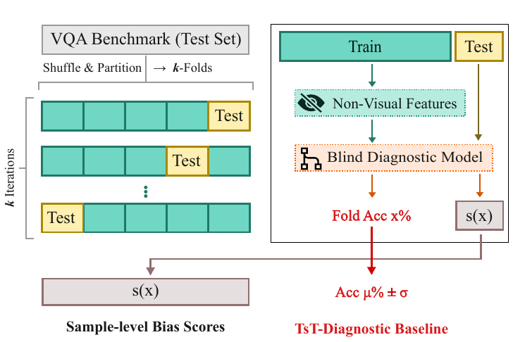

<div align="center">

# TsT: Test-set Stress-Test

**Benchmark Designers Should "Train on the Test Set" to Expose Exploitable Non-Visual Shortcuts**

[](https://openreview.net/forum?id=ggtdDv1l9s)
[](https://arxiv.org/abs/2511.04655)
[](https://arxiv.org/pdf/2511.04655)
[](https://vision-x-nyu.github.io/test-set-training/)
[-FED123.svg?style&logo=HuggingFace)](https://hf.co/datasets/nyu-visionx/VSI-Bench)
[](LICENSE)

</div>

Multimodal models can score well on vision benchmarks without looking, by exploiting answer
priors and patterns in the question text. **If a benchmark can be gamed, it will be.** TsT gives
benchmark designers a cheap check before release: cross-validate a text-only model on the test
set's own questions and answer options, so that every question is scored by a model that never
trained on it. The gain over the same model's zero-shot score is what can be learned from the test
set without the image or video, and the per-question score s(x) shows which questions to review.

In the paper, Qwen2-7B fine-tuned without images on the other folds scores 42.7 on VSI-Bench's
held-out questions, against 24.7 zero-shot (+17.9 from unrounded scores), and 60.3 against 47.3 on
CV-Bench (+13.1), while MMMU shows little learnable signal (−0.7), even though GPT-4o answers 52.3% of its multiple-choice questions blind: a high blind score
alone cannot tell pretrained knowledge from test-set patterns. Iterative Bias Pruning (IBP) uses
s(x) to remove the most exploitable questions and re-diagnose the rest. VSI-Bench-Debiased, a
designer-in-the-loop pilot built with hand-written filters rather than IBP, lowers a fine-tuned
model's blind score from 44.7 to 32.0 while its vision score drops only from 57.1 to 48.7.

<p align="center">
  
</p>

> **Responsible use.** TsT should be run by benchmark designers before release to audit the
> benchmark itself. It should not be used to tune deployed models on evaluation answers, and TsT
> scores should not be reported as ordinary no-access model performance.

## Quick start

Python 3.10 to 3.12 and [`uv`](https://docs.astral.sh/uv/):

```bash
git clone https://github.com/vision-x-nyu/test-set-training.git && cd test-set-training
uv sync --frozen                  # CPU core: TsT-RF, IBP, reproduction scripts
uv sync --frozen --extra llm      # optional: TsT-LLM (Linux x86_64, one NVIDIA GPU)
```

**TsT-RF** trains a random forest on hand-crafted non-visual features and runs on a CPU in about
15–20 seconds:

```bash
uv run python -m TsT --benchmark vsi --group_col scene_name --output_dir outputs/vsi
```

```text
TsT-RF | benchmark: vsi (nyu-visionx/VSI-Bench @ bc96b17) | feature set: default | 5-fold, grouped by scene_name | ...

         question type format metric score  std   n
       object_counting    num    mra 37.31 1.57 565
   object_abs_distance    num    mra 32.41 0.89 834
object_size_estimation    num    mra 61.64 1.57 953
  ...
weighted mean: 38.82   macro mean: 37.19   (questions scored: 5130)
```

**TsT-LLM**, the paper's primary diagnostic, LoRA-fine-tunes a text-only LLM (Qwen2-7B-Instruct by
default) on the other folds and compares it with its zero-shot score; VSI-Bench takes 40–50
minutes on one 80 GB GPU:

```bash
uv run python -m TsT --benchmark vsi --mode llm --output_dir outputs/vsi_llm
```

**IBP** prunes the highest-scoring questions in batches and re-diagnoses the rest (about 2 minutes on a CPU):

```bash
uv run python -m TsT.debiasing --benchmark vsi --alloc per_format --budget 1000 --output_dir outputs/ibp_vsi
```

To run TsT on your own benchmark, start with `uv run python examples/custom_benchmark.py` and
[docs/your-benchmark.md](docs/your-benchmark.md).

## What you get

```text
outputs/vsi/
├── summary.json      # settings (dataset revision, row-order fingerprint, folds, seed, versions),
│                     #   weighted and macro means, per-question-type scores
└── s_x.csv           # one row per question: id, question type, format, s (= s(x)), chance, s_minus_chance
outputs/vsi_llm/      # TsT-LLM: the same two files, plus
├── ...               #   zero-shot scores and the gain over them (ΔTsT) in summary.json; s_zero_shot and delta in s_x.csv
└── predictions/      #   every prompt's prediction and option probabilities, per fold
outputs/ibp_vsi/
├── removed_ids.txt   # removed question ids, in removal order
├── kept_ids.txt
└── summary.json      # budgets, settings and every iteration's bias scores
```

s(x) is the held-out score of each question: the probability of the gold option for
multiple-choice (MC) questions and the mean relative accuracy (MRA) for numerical (NUM) ones. Rank questions
within one format, and for multiple-choice use `s_minus_chance`, since raw probabilities favour
questions with fewer options; [docs/interpreting-results.md](docs/interpreting-results.md) explains
how to read both files.

| Benchmark | `--benchmark` | TsT-RF | TsT-LLM | Questions |
|---|---|:---:|:---:|---|
| [VSI-Bench](https://hf.co/datasets/nyu-visionx/VSI-Bench) | `vsi` | ✓ | ✓ | 5,130 (2,490 MC, 2,640 numerical) |
| [CV-Bench](https://hf.co/datasets/nyu-visionx/CV-Bench) | `cvb` | ✓ | ✓ | 2,638 MC |
| VideoMME | `video_mme` | | ✓ | 2,700 MC |
| MMMU (validation) | `mmmu` | | ✓ | 847 MC (open-ended questions are not scored) |
| [MMStar](https://huggingface.co/datasets/Lin-Chen/MMStar) | `mmstar` | | ✓ | 1,500 MC |

Every benchmark is pinned to a Hugging Face dataset revision and checked against its row order,
because shuffled folds depend on it.

## Reproducing the paper

The paper's TsT-RF scores, VSI-Bench-Debiased evaluation, automated IBP tables and GPT-4o
baselines reproduce exactly on a CPU with one command each, and TsT-LLM reruns land within the
run-to-run variation the paper describes. [docs/reproducing.md](docs/reproducing.md) has the
commands and expected values.

## Documentation

- [Getting started](docs/getting-started.md): install, command-line options, outputs, Python API
- [TsT-LLM](docs/tst-llm.md): requirements, settings and outputs of `--mode llm`
- [IBP](docs/ibp.md): Iterative Bias Pruning with TsT-RF or TsT-LLM scores
- [Your own benchmark](docs/your-benchmark.md): features, label-leakage checks, TsT-LLM prompts
- [Interpreting results](docs/interpreting-results.md): what the scores and s(x) mean, and how not to misread them
- [Evaluating on VSI-Bench-Debiased](docs/evaluating-on-debiased.md): configs, scoring and the blind-score drop
- [Reproducing the paper](docs/reproducing.md): every reproduced value and the code-vs-paper notes
- [Paper settings](docs/paper-settings.md): the TsT-LLM configuration (App. C.1), value by value
- [Development](docs/development.md): code map and repository checks
- [Third-party notices](THIRD_PARTY_NOTICES.md): adapted code and the datasets' own terms

## Related projects

- [Cambrian-1](https://cambrian-mllm.github.io/cambrian-1): A Fully Open, Vision-Centric Exploration of Multimodal LLMs
- [Cambrian-S](https://cambrian-mllm.github.io/cambrian-s): Towards Spatial Supersensing in Video
- [Thinking in Space](https://vision-x-nyu.github.io/thinking-in-space.github.io/): How Multimodal Large Language Models See, Remember and Recall Spaces
- [SIMS-V](https://ellisbrown.github.io/sims-v): Simulated Instruction-Tuning for Spatial Video Understanding

## Citation

```bibtex
@inproceedings{brown2026benchmark,
  title     = {{Benchmark Designers Should ``Train on the Test Set'' to Expose Exploitable Non-Visual Shortcuts}},
  author    = {Brown, Ellis and Yang, Jihan and Yang, Shusheng and Fergus, Rob and Xie, Saining},
  booktitle = {COLM},
  year      = {2026}
}
```
